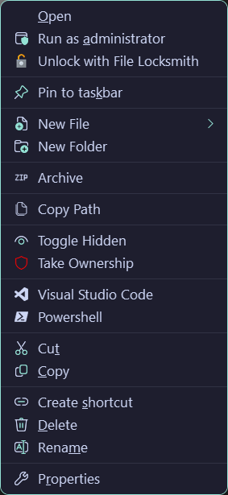
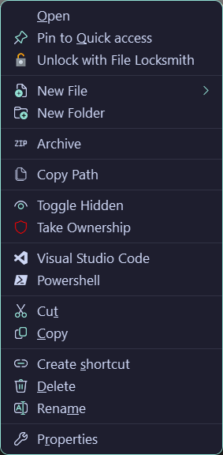
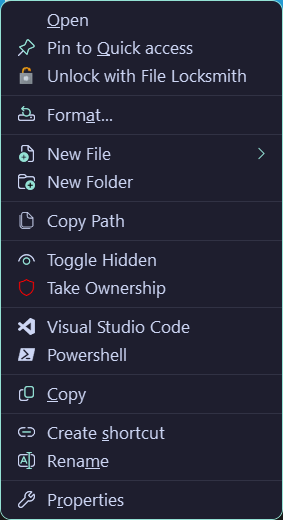
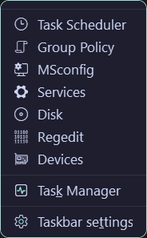

# Config files for [Nilesoft Shell](https://github.com/moudey/Shell)

> [!IMPORTANT]
> The archive funtion uses [7zip](https://www.7-zip.org/download.html).
> _Make sure to add the 7zip directory to the path_

## Screenshots

| File  | Folder |
| ------------- | ------------- |
|   |   |

| Drive  | Taskbar |
| ------------- | ------------- |
|   |   |

## Features:

- Moved most of the cluttered options to the default menu for easy access
- Removed many options that are never used by most users
- Added single click archive option (works with both file(s) and folder(s))
- Added single click unarchive option 
- Uses [catppuccin mocha](https://github.com/catppuccin/nilesoft-shell) theme
- Added shortcuts to windows utilities with taskbar right click

## Remove context menu options:

- Power Options
- New 
- Notepad
- Add to Favorites
- Troubleshoot compatibility
- Microsoft Defender
- Sync
- option to toggle offline available for network drives
- autoplay
- bitlocker
- 7-zip
- customize this folder
- give access
- open with
- Share
- Restore previous versions
- send to
- Include in library
- Pin to Start
- print
- Open PowerShell window here
